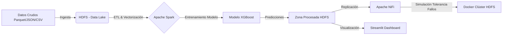

# 📡 Pipeline End-to-End de Big Data para Predicción de Churn

   

## 📋 Descripción del Proyecto

Solución integral de Ingeniería de Datos y Machine Learning diseñada para identificar clientes en riesgo de abandono (Churn) en el sector de telecomunicaciones.

El proyecto implementa un **Pipeline automatizado** que ingesta datos transaccionales masivos (llamadas, facturación, redes sociales), los transforma mediante un ETL distribuido, y entrena un modelo de **Gradient Boosting (XGBoost)** para predecir la probabilidad de fuga. Los resultados se orquestan automáticamente y se visualizan en un Dashboard interactivo para la toma de decisiones inmediata.

## 🏗️ Arquitectura de la Solución

El flujo de datos sigue una arquitectura moderna de Big Data:




## 🛠️ Tecnologías

  * **Procesamiento Distribuido:** Apache Spark (PySpark).
  * **Orquestación:** Apache Airflow (DAGs programados diariamente).
  * **Almacenamiento:** HDFS (Hadoop Distributed File System).
  * **Machine Learning:** Spark MLlib + XGBoost (Classification).
  * **Ingeniería de Datos:** Apache NiFi (Flujos de datos automatizados).
  * **Infraestructura:** Docker (Simulación de clúster distribuido) & Debian 12.
  * **Visualización:** Streamlit (Python).

## 🚀 Características Clave

1.  **ETL Modular:** Limpieza, agregación y transformación de datos (Joins, OneHotEncoding, VectorAssembler) automatizados con Spark.
2.  **Modelo Predictivo:** Implementación de algoritmo Gradient Boosting con una precisión y AUC cercanas al 100% en datos de prueba.
3.  **Tolerancia a Fallos:** Simulación validada usando contenedores Docker, demostrando replicación de datos (Factor=2) ante la caída de nodos.
4.  **Dashboard Operativo:** Panel en Streamlit con alertas en tiempo real para clientes con probabilidad de churn \> 75%.
5.  **Orquestación Robusta:** DAGs de Airflow que gestionan dependencias, reintentos y alertas de fallo.

## 📊 Visualización


## 📂 Estructura del Repositorio

```bash
├── airflow/
│   └── dags/               # DAGs de orquestación (pipeline_churn_dag.py)
├── scripts/
│   ├── etl_churn.py        # Lógica de extracción y transformación Spark
│   └── inference_churn.py  # Aplicación del modelo predictivo
├── dashboard/
│   └── dashboard_churn.py  # Código de la aplicación Streamlit
├── docker/                 # Configuración del clúster de simulación (docker-compose)
└── notebooks/              # Análisis Exploratorio (EDA) y prototipado
```
